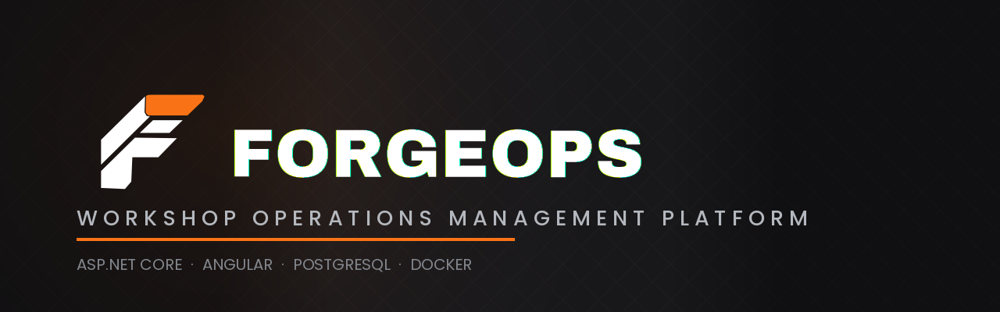

# ForgeOps

**Workshop Operations Management Platform**

ForgeOps is a full-stack workshop management platform designed to centralise the day-to-day operations of an automotive workshop.

The project is being developed as a production-style application using **ASP.NET Core, Angular and PostgreSQL**, with a focus on clean architecture, maintainability, security, testing and real-world business requirements.

> **Status:** 🚧 Initial development

---

## Overview

Automotive workshops often rely on a combination of spreadsheets, paper records and messaging applications to manage customers, vehicles, work orders, technicians and inventory.

ForgeOps aims to bring these operations into a single system.

The platform will provide:

* Customer management
* Vehicle management and ownership history
* Work order management
* Technician assignment
* Vehicle inspections
* Parts and inventory management
* Invoicing
* Role-based access control
* Audit logging
* Real-time workshop updates
* Operational dashboards

The system is being designed with future multi-workshop support in mind, although multi-tenancy is outside the scope of the initial MVP.

---

## Technology Stack

### Backend

* C#
* .NET
* ASP.NET Core Web API
* Entity Framework Core
* PostgreSQL
* MediatR
* FluentValidation
* Serilog
* SignalR
* xUnit

### Frontend

* Angular
* TypeScript
* RxJS
* Angular Signals
* Reactive Forms
* Angular Router

### Infrastructure

* Docker
* Docker Compose
* GitHub Actions
* PostgreSQL

---

## Architecture

ForgeOps is maintained as a monorepo.

```text
forgeops/
│
├── apps/
│   ├── api/                 # ASP.NET Core API
│   └── web/                 # Angular application
│
├── tests/
│   ├── api.unit/
│   └── api.integration/
│
├── docs/
│
├── docker/
│
├── .github/
│   └── workflows/
│
├── docker-compose.yml
└── README.md
```

The intended application architecture is:

```text
┌─────────────────────┐
│       Angular       │
│      Web Client     │
└──────────┬──────────┘
           │
           │ HTTP / SignalR
           ▼
┌─────────────────────┐
│    ASP.NET Core     │
│      Web API        │
└──────────┬──────────┘
           │
           ▼
┌─────────────────────┐
│    Application      │
│       Layer         │
└──────────┬──────────┘
           │
           ▼
┌─────────────────────┐
│       Domain        │
│       Layer         │
└──────────┬──────────┘
           │
           ▼
┌─────────────────────┐
│   Infrastructure    │
│    / EF Core        │
└──────────┬──────────┘
           │
           ▼
┌─────────────────────┐
│     PostgreSQL      │
└─────────────────────┘
```

The architecture is intentionally designed around separation of concerns while avoiding unnecessary abstraction.

---

## Core Domain

The initial domain consists of:

```text
Workshop
 ├── Users
 ├── Customers
 │    └── Vehicles
 │         └── Work Orders
 │              ├── Labour
 │              ├── Parts
 │              ├── Inspections
 │              ├── Notes
 │              └── Status History
 │
 ├── Technicians
 │
 ├── Inventory
 │
 └── Invoices
```

---

## Work Order Lifecycle

Work orders will follow a controlled lifecycle:

```text
DRAFT
  │
  ▼
QUOTED
  │
  ▼
APPROVED
  │
  ▼
IN_PROGRESS
  │
  ├──────────────► AWAITING_PARTS
  │                    │
  │                    ▼
  └──────────────► IN_PROGRESS
                       │
                       ▼
                 QUALITY_CHECK
                       │
                       ▼
                   COMPLETED
                       │
                       ▼
                    INVOICED
```

Invalid state transitions will be rejected by the backend.

---

## Security

ForgeOps will implement role-based access control.

Initial roles:

| Role          | Responsibility                      |
| ------------- | ----------------------------------- |
| Administrator | System and user administration      |
| Manager       | Workshop management                 |
| Receptionist  | Customers, vehicles and work orders |
| Technician    | Vehicle work and inspections        |

Authorization will be enforced by the API.

The frontend will provide appropriate UI restrictions, but **frontend authorization will never be treated as a security boundary**.

---

## Auditing

Important business operations will generate immutable audit records.

Examples include:

* Customer creation
* Vehicle ownership changes
* Work order status changes
* Technician assignments
* Inventory adjustments
* Quote approval
* Invoice issuance
* Payment recording

The audit trail is intended to provide a clear history of who performed an action, what changed and when it occurred.

---

## Real-Time Updates

ForgeOps will use **SignalR** for real-time operational events.

Examples:

* Work order status changes
* Technician assignments
* Inventory updates
* Workshop activity

This will allow connected users to see relevant operational changes without manually refreshing the application.

---

## Development Principles

The project is being developed around the following principles:

* Business rules belong on the backend.
* The database is treated as a first-class part of the system.
* Financial calculations are performed server-side.
* Authorization is enforced server-side.
* Important business actions are auditable.
* Large datasets are paginated and filtered server-side.
* Automated tests should protect business-critical behaviour.
* Infrastructure should be reproducible.
* Complexity should be introduced only when it solves an actual problem.

---

## Development Roadmap

### Phase 1 — Foundation

* [x] Repository setup
* [ ] .NET solution
* [ ] Angular application
* [ ] PostgreSQL
* [ ] Docker Compose
* [ ] Initial CI pipeline
* [ ] Database migrations
* [ ] Authentication foundation

### Phase 2 — Core Operations

* [ ] Customers
* [ ] Vehicles
* [Vehicle ownership history]
* [ ] Technicians
* [ ] Work orders
* [ ] Work order state transitions
* [ ] Labour
* [ ] Parts

### Phase 3 — Workshop Management

* [ ] Inventory
* [ ] Inventory transactions
* [ ] Vehicle inspections
* [ ] Invoicing
* [ ] Audit logging
* [ ] Dashboard
* [ ] Search, filtering and pagination

### Phase 4 — Production Features

* [ ] SignalR real-time updates
* [ ] Comprehensive automated testing
* [ ] Structured logging
* [ ] Error handling
* [ ] Security review
* [ ] Performance review
* [ ] Production Docker configuration
* [ ] Documentation

---

## Local Development

Local development instructions will be added as the initial infrastructure is established.

The intended developer experience is:

```bash
git clone <repository>

docker compose up
```

The application should eventually be runnable locally without requiring developers to manually configure infrastructure dependencies.

---

## Testing

ForgeOps will contain multiple levels of automated testing.

### Unit Tests

Business rules and domain behaviour.

### Integration Tests

API behaviour and database interactions.

### Frontend Tests

Angular components, services and important user workflows.

The goal is to test **business behaviour**, rather than simply maximise code coverage.

---

## Project Status

ForgeOps is currently in the initial development phase.

The architecture and requirements are intentionally being established before significant feature development begins.

This repository represents an engineering project rather than a tutorial implementation.

---

## License

This project is currently not licensed for redistribution.
